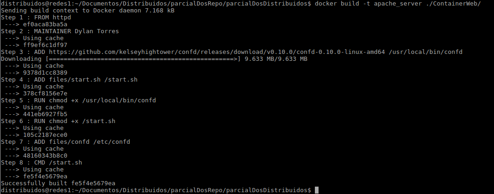

# DockerBalancerSD

### Examen 2
**Universidad ICESI**  
**Curso:** Sistemas Distribuidos  

### Nombre: Dylan Dabian Torres
### Código: A00265772
### Repositorio GITHUB: https://github.com/dylan9538/SDBalancerDocker

### Objetivos
* Realizar de forma autónoma el aprovisionamiento automático de infraestructura
* Diagnosticar y ejecutar de forma autónoma las acciones necesarias para lograr infraestructuras estables
* Integrar servicios ejecutandose en nodos distintos

### Prerrequisitos
* Docker
* Imágenes de sistemas operativos a elección del estudiante

### Descripción del problema 
Aprovisionamiento	de	un	ambiente	compuesto	por	los	siguientes	elementos:	un servidor	encargado de	realizar balanceo de	carga,	tres	servidores	web	con páginas estáticas. Se	debe probar	el	funcionamiento	del balanceador	realizando peticiones y mostrando servidores distintos atendiendo las peticiones.

<p align="center">
  
</p>

## Pasos preliminares

**GITHUB**

Para realizar la subida de archivos al repositorio en github se realizaran los siguientes pasos, o es importante tenerlos en cuenta:

Creamos dentro de la carpeta distribuidos un nuevo directorio llamado parcialUnoRepo:

```
mkdir parcialDosRepo
cd parcialDosRepo
```

**1)Clono el repositorio que necesito**

En este repositorio añadiremos los archivos que se manejen.

```
git clone https://github.com/dylan9538/SDBalancerDocker.git
cd SDBalancerDocker

git config remote.origin.url "https://token@github.com/dylan9538/SDBalancerDocker.git"
```
En el campo token añado el token generado en github.

**2)subir archivos**

1)Creo el archivo si no existe.

2)Sigo los siguientes comandos:
Estos comandos los ejecuto donde se encuentra ubicado el archivo a cargar.

```
git add nombreArchivo
git commit -m "upload README file"
git push origin master
```
## SOLUCION DEL PROBLEMA

### Consignación de los comandos de linux necesarios para el aprovisionamiento de los servicios solicitados (PRE)

**Usaremos Nginx que permite realizar el balanceo de carga necesario:**

**¿Que es nginx?**

Es un servidor web/proxy inverso ligero de alto rendimiento y un proxy para protocolos de correo electrónico. Es software libre y de código abierto; también existe una versión comercial distribuida bajo el nombre de nginx plus. Es multiplataforma, por lo que corre en sistemas tipo Unix (GNU/Linux, BSD, Solaris, Mac OS X, etc.) y Windows.

**Web**
Para el despliegue del servidor web de apache ejecutamos los siguientes comandos, primero se realiza la instalacion y luego se inicia el servicio:

``
sudo apt-get update
sudo apt-get install apache2
sudo service apache2 start
``

### Balancer nginx

Primero se instala nginx, ejecuntando los siguientes comandos:

```
sudo apt-get update
sudo apt-get install Nginx
```

Luego de instalar nginx se configura el archivo nginx.conf con el siguiente contenido:

```bash
worker_processes 3;
events { worker_connections 1024; }
http {
    sendfile on;
    upstream app_servers {
        server server_1;
        server server_2;
        server server_3;
    }
    server {
        listen 80;
        location / {
            proxy_pass         http://app_servers;
            proxy_redirect     off;
            proxy_set_header   Host $host;
            proxy_set_header   X-Real-IP $remote_addr;
            proxy_set_header   X-Forwarded-For $proxy_add_x_forwarded_for;
            proxy_set_header   X-Forwarded-Host $server_name;
        }
    }
}
```

Luego procedemos a corre el servicio del balanceador y ejecutamos los siguientes comandos donde abrimos el puerto definido en el archivo de configuración anterior:

```bash
iptables -I INPUT -p tcp --dport 8080 --syn -j ACCEPT
service iptables save
service iptables restart
service nginx start
```

Luego de ejecutar el comando anterior probamos en el browser si nuestro balanceador de carga esta funcionando digitando la ip del balanceador y el puerto 8080. 

### SOLUCIÓN PROPUESTA PARA AUTOMATIZAR

Primero fue esenciar tenes descargadas las imagenes de httpd (para los servicios web) y nginx (para el balanceador). Para ello se siguieron los siguientes comandos:

```
docker pull httpd
docker pull nginx
```

**Para el desarrollo de los contenedores se usa Docker como herramienta**

A continuación se explicara paso a paso el desarrollo de cada uno de los files necesarios para la creación y caracterización de los contenedores web y el contenedor del balanceador (nginx). 

**CONTAINER BALANCER NGINX**

Se crea un directorio llamado **ContainerBalancer**, donde encontraremos los siguientes archivos.

Primero se tiene el Dockerfile con el siguiente contenido, el cual contiene configuración necesaria para trabajar con el nginx instalado ya:

```
#Se usa el contenedor con nginx pre instalado
FROM nginx

#delete configuration file default
RUN rm /etc/nginx/conf.d/default.conf && rm -r /etc/nginx/conf.d

#add nginx's configuration file
ADD nginx.conf /etc/nginx/nginx.conf

#Container don't stop execution
RUN echo "daemon off;" >> /etc/nginx/nginx.conf
CMD service nginx start
```

Luego tenemos el archivo llamado nginx.conf con el siguiente contenido, en el cual se especifican la cantidad de servidores web que se utilizaran en el balanceo de carga y se especifica que trabajara como proxy:

```
worker_processes 3;
events { worker_connections 1024; }
http {
    sendfile on;
    upstream app_servers {
        server server_1;
        server server_2;
        server server_3;
    }
    server {
        listen 80;
        location / {
            proxy_pass         http://app_servers;
            proxy_redirect     off;
            proxy_set_header   Host $host;
            proxy_set_header   X-Real-IP $remote_addr;
            proxy_set_header   X-Forwarded-For $proxy_add_x_forwarded_for;
            proxy_set_header   X-Forwarded-Host $server_name;
        }
    }
}
```

**CONTAINER WEB**

**PARA LA PARTE DE LA PARAMETRIZACIÓN DE LAS PAGINAS Y PODER DIFERRENCIAR Y VISUALIZAR QUE EL BALANCEO DE CARGA SE ESTA HACIENDO SE USARA CONFD. Esta es una herramienta para gestionar variables del entonor en el contenedor, buscando setear diferentes archivos.**

En este contenedor web se configrara en un directorio llamado **ContainerWeb**  y en el tendremos principalmente dos partes que se presentan acontinuación:

Primero encontramos el Dockerfile que contiene lo siguiente:

```
FROM httpd
MAINTAINER Dylan Torres

##Se bajan los recursos confd
ADD https://github.com/kelseyhightower/confd/releases/download/v0.10.0/confd-0.10.0-linux-amd64 /usr/local/bin/confd
ADD files/start.sh /start.sh

RUN chmod +x /usr/local/bin/confd
RUN chmod +x /start.sh

ADD files/confd /etc/confd

CMD ["/start.sh"]
```

Se especifica que el contenedor usara para la parte de web Apache (httpd). Es necesario bajar los recursos de de confd y realizar la configuracion para el archivo start.sh que es parte para que esto se logre.

En el contenedor web encontramos tambien una carpeta llamada files que tiene el siguiente contenido. Primero contiene el archivo **start.sh** que se comento anteriormente, y contiene un directorio **confd** con el template y pagina web. 

El archivo **start.sh** tiene el siguiente contenido. En el se asignan valores por defecto a las variables del entorno si se da el caso de que no se setan al montar el contenedor web. Con el flag de -backend env se le informa  a confd que las variables que estan en los templates seran adquiridas  de las variables del entorno del contenedor web y al final se ejecuta el servidor web httpd. Este es el ejecutable que se usa como entrypoint del contenedor y llama los comandos que se encargan de asociar las variables del entorno a los templates.

```
#!/bin/bash
set -e  

# if $proxy_domain is not set, then default to $HOSTNAME
export namePage=${namePage:-"No parameter asigned"}

# ensure the following environment variables are set. exit script and container if not set.
test $namePage

/usr/local/bin/confd -onetime -backend env

echo "Starting web server apache"
exec httpd -DFOREGROUND
```

Dentro del directorio **confd** tenemos dos carpetas. 
Primero se tiene la carpeta **conf.d** donde tenemos un archivo llamado **index.html.toml**. Este archivo es el gestor del template, y en el se especifica cual es el template que se renderizará y donde se enviara luego de ser renderizado. Tiene el siguiente contenido:

```
[template]
src = "index.html.tmpl"
dest = "/usr/local/apache2/htdocs/index.html"
```

Segundo se tiene la carpeta llamada **templates**  donde se tiene un archivo llamado **index.html.tmpl**, el cual es nuestro template. En el estamos creando nuestra variable del entorno. Este sera nuestra vista del servidor web:

```
<html>
<body>
<h1>Paginas parcial 2 Distribuidos</h1>
<p>Cambiando a la page</p>
{{ getenv "namePage" }}
</body>
</html>
```

Con esto ya queda terminada la configuracion del contenedor web.

**DOCKER-COMPOSE.YML**

Finalmente se procede a crear el archivo **docker-compose.yml**.

```
version: '2'

services:
  server_1:
    image: apache_server
    environment:
      - namePage= AppOne
    expose:
      - "5000"
    volumes: 
      - volumen_web:/volumen_web

  server_2:
    image: apache_server
    environment:
      - namePage=AppTwo
    expose:
      - "5000"
    volumes: 
      - volumen_web:/volumen_web

  server_3:
    image: apache_server
    environment:
      - namePage=AppThree
    expose:
      - "5000"
    volumes: 
      - volumen_web:/volumen_web

  proxy:
    build:
      context:  ./ContainerBalancer
      dockerfile: Dockerfile
    ports:
      - "8080:80"
    links:
      - server_1
      - server_2
      - server_3

    volumes: 
      - volumen_nginx:/volumen_nginx

volumes:
   volumen_web:
   volumen_nginx:
```

En este .yml especificamos los servicios web que correran y para cada uno se ponen: 

* La imagen bajo la cual estaran. En este caso la imagen **apache_server** 
* Se asocian las variables del entorno que se asignaran al template
* El puerto 
* y finalmente el volumen 

Tambien se construye el proxy, que en este caso es el que se configuro con nginx en el directorio **ContainerBalancer**.

Es importante aclarar que se manejan los volumenes siguientes:
* volumen_web
* volumen_nginx

Estos permiten compartir archivos de configuracion o de cualquier tipo entre contenedores. Se realiza como plus.

### RUN DEL PROYECTO Y PRUEBAS DE FUNCIONAMIENTO

**Para las pruebas de funcionamiento primero debemos de construir la imagen para los servicios web. Con el siguiente comando:**

```
docker build -t apache_server ./ContainerWeb/
```

<p align="center">
  
</p>

**Luego procedemos a contruir el docker-compose.yml y montarlo, con los siguientes comandos:**

```
sudo docker-compose  build --no-cache
```

<p align="center">
  
</p>

```
sudo docker-compose up
```

<p align="center">
  
</p>

**Con ello obtenemos las siguientes pruebas de funcionamiento de nuestro balanceador de cargar con Docker y conf.**

<p align="center">
  
</p>

<p align="center">
  
</p>

<p align="center">
  
</p>

**Tambien tenemos la lista de los contenedores montados:**

<p align="center">
  
</p>

**Y la lista de los volumenes:**
<p align="center">
  
</p>

**Para probar el funcionamiento de los volumenes, se tomara el volumen de los servicios web. Lo primero que se debe hacer es  ingresar a uno de los contenedores web en funcionamiento y creamos un archivo cualquiera, en este caso llamado, filePrueba.txt, como se muestra en la siguiente imagen:**
<p align="center">
  
</p>

**Luego verificamos que este se encuentre compartido con el host, para ello buscamos donde se encuentran ubicados los volumenes creados e ingresamos habilitando todos los permisos, y finalmente encontramos que el archivo filePrueba.txt si se encuentra compartido con el host. Tambien era posible ingresar a otro de los contenedores web y se podia visualizar que el .txt tambien se encontraba en el** 
<p align="center">
  
</p>

## FIN DEL DOCUMENTO


